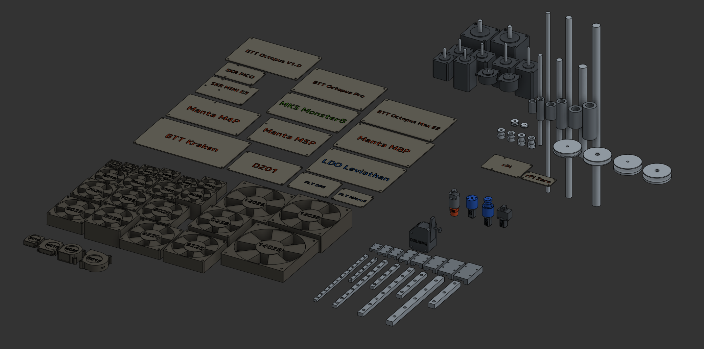

# 3DPCR - 3D Printer Component Repository

Welcome to the 3D Printer Component Repository (3DPCR)!

This is a master CAD library designed to be the ultimate reference for anyone building custom 3D printers, toolheads, or motion systems. Instead of heavy, overly-detailed STEP files that crash your CAD software, everything here is built as lightweight "clearance models" (strictly for layout, clearance checking, and assembly mapping).

## 🔗 Important Links

* **[Live 3DPCR Guide & Documentation](https://3dpcr.kanrog.com)**
* **[Kanrog Creations Main Website](https://kanrog.com)**

## 🛠️ How to Use

You can view, use, and export from the live Onshape document directly through your browser—no software installation required. 

For full step-by-step instructions on how to insert these parts into your assemblies, derive them for custom designs, or export them for offline CAD software (Fusion360, SolidWorks, etc.), please read the [official guide here](https://3dpcr.kanrog.com).

## 🤝 Contributing

The 3D printing space moves fast! If you want to help expand the library (especially the hotend and extruder sections), community contributions are welcome. 

**Rules for submission:**
1. **Original Models Only:** You must model the part yourself. No files downloaded from Printables, MakerWorld, GrabCAD, etc., due to licensing restrictions.
2. **Keep it Simple:** Strip out internal gears, cooling fins, and PCB traces. Models must be simplified to external dimensions, mounting holes, and critical clearances.

Reach out via the contact form on [kanrog.com](https://kanrog.com) to submit your Onshape documents!

---
*Created and maintained by Kanrog Creations*
